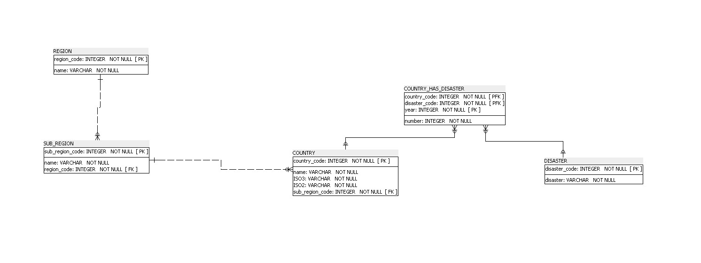

# bdd_catastrophes_naturelles

Depuis le fichier plat "Climate_related_disasters_frequency.csv" et ses différentes colonnes, j'ai établi le diagramme relationnel suivant :

C'est à partir de celui-ci que j'ai pu créer ma base de données et enfin l'alimenter dans le fichier "script_bdd_catastrophes_naturelles.sql"
